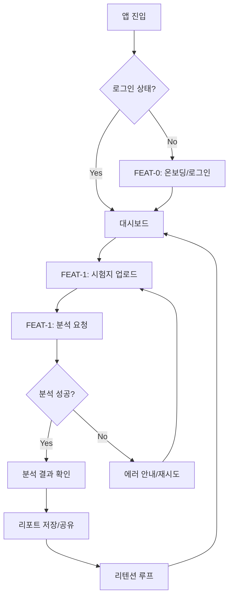
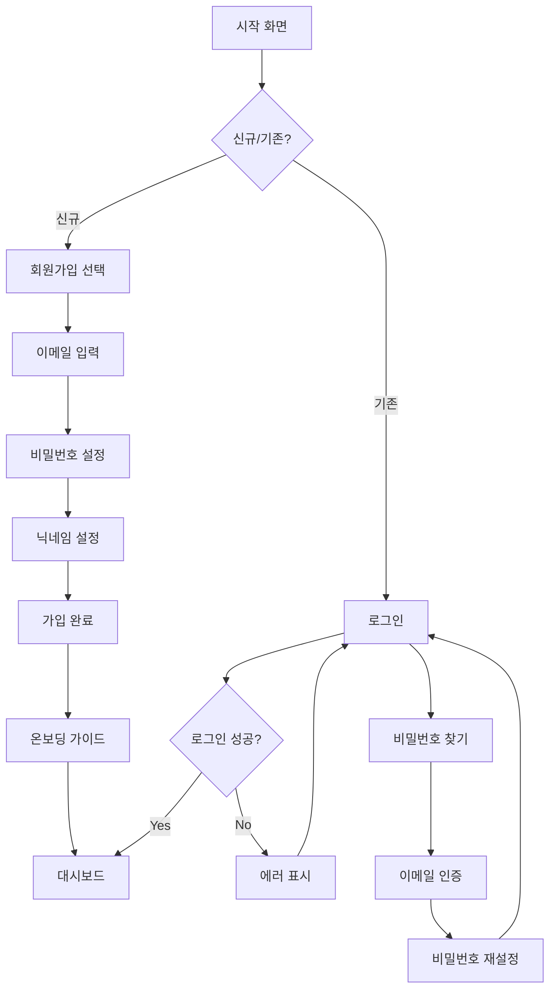
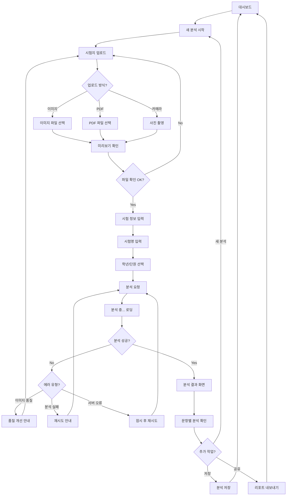
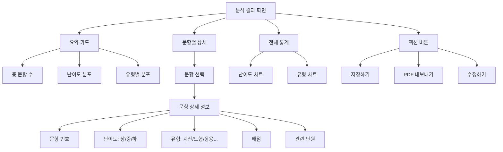
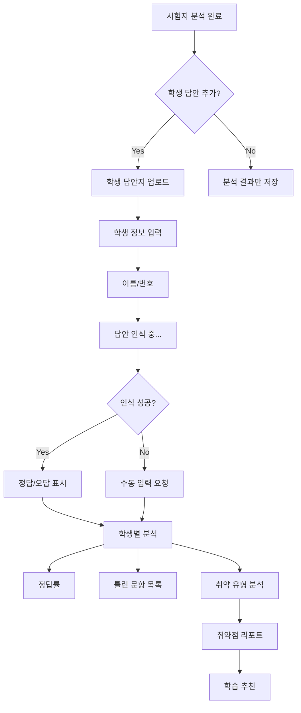
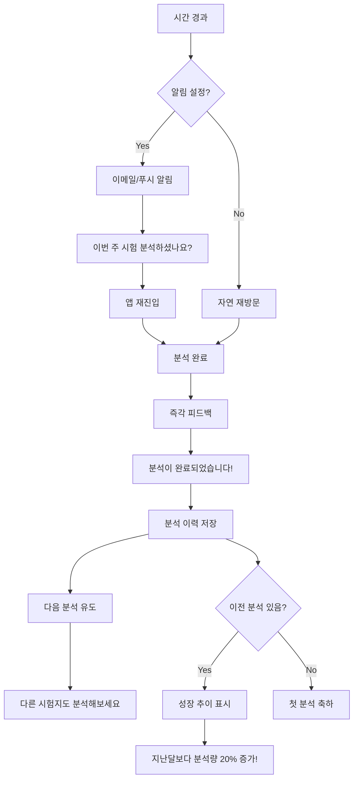
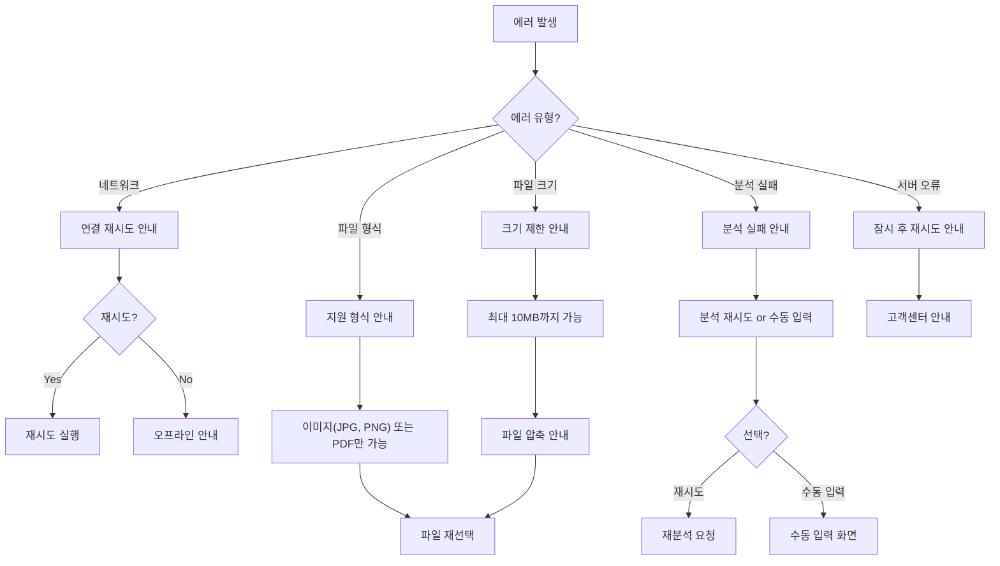

# User Flow (사용자 흐름도)

> Mermaid 플로우차트로 핵심 기능의 주요 여정을 표현합니다.
> 성공/실패 분기를 포함하고, 온보딩→핵심작업→리텐션 루프를 표현합니다.

---

## MVP 캡슐

| # | 항목 | 내용 |
|---|------|------|
| 1 | 목표 | 수학 시험지를 AI로 분석하여 일관되고 객관적인 분석 결과 제공 |
| 2 | 페르소나 | 학원 운영자, 선생님 (교육업계 종사자) |
| 3 | 핵심 기능 | FEAT-1: 문항별 분석 (난이도, 유형, 정답률) |
| 4 | 성공 지표 (노스스타) | AI 분석 정확도/일관성 |
| 5 | 입력 지표 | 주간 분석 횟수, 사용자 만족도 |
| 6 | 비기능 요구 | 분석 결과 일관성 (같은 시험지 = 같은 맥락의 결과) |
| 7 | Out-of-scope | 외부 연동 (소셜로그인, 결제), 실시간 협업 |
| 8 | Top 리스크 | OCR 인식 정확도 (이미지/PDF에서 문제 추출 실패) |
| 9 | 완화/실험 | 수동 입력 폴백, 사용자 피드백으로 모델 개선 |
| 10 | 다음 단계 | 문항별 분석 MVP 개발 |

---

## 1. 전체 사용자 여정 (Overview)



---

## 2. FEAT-0: 온보딩/로그인 플로우



### 온보딩 가이드 내용
1. "시험지 사진이나 PDF를 업로드하세요"
2. "AI가 문항별로 분석해드려요"
3. "분석 결과로 학습 방향을 잡으세요"

---

## 3. FEAT-1: 시험지 분석 플로우 (MVP 핵심)



---

## 4. 분석 결과 확인 플로우



---

## 5. 학생 답안 분석 플로우 (v2 예정)



---

## 6. 리텐션 루프 (습관 형성)



---

## 7. 에러 처리 플로우



---

## 8. 화면 목록 (Screen Inventory)

| 화면 ID | 화면명 | FEAT | 진입점 | 주요 액션 |
|---------|--------|------|--------|----------|
| S-01 | 랜딩 페이지 | - | URL 진입 | 로그인/가입 선택 |
| S-02 | 로그인 | FEAT-0 | S-01 | 이메일 로그인 |
| S-03 | 회원가입 | FEAT-0 | S-01 | 계정 생성 |
| S-04 | 온보딩 가이드 | FEAT-0 | S-03 | 서비스 소개 확인 |
| S-05 | 대시보드 | - | S-02, S-04 | 새 분석, 이력 조회 |
| S-06 | 시험지 업로드 | FEAT-1 | S-05 | 파일 업로드 |
| S-07 | 시험 정보 입력 | FEAT-1 | S-06 | 시험명, 학년 입력 |
| S-08 | 분석 중 (로딩) | FEAT-1 | S-07 | 대기 |
| S-09 | 분석 결과 | FEAT-1 | S-08 | 결과 확인, 저장 |
| S-10 | 분석 상세 | FEAT-1 | S-09 | 문항별 상세 확인 |
| S-11 | 분석 이력 | - | S-05 | 과거 분석 조회 |
| S-12 | 에러 화면 | - | 전체 | 에러 안내, 재시도 |

---

## 9. 화면별 와이어프레임 개요

### S-05: 대시보드

```
┌─────────────────────────────────────────┐
│  [Logo]          수학 시험지 분석기  [👤]  │
├─────────────────────────────────────────┤
│                                         │
│  ┌─────────────────────────────────┐   │
│  │     + 새 시험지 분석하기         │   │
│  └─────────────────────────────────┘   │
│                                         │
│  최근 분석                               │
│  ┌─────────────────────────────────┐   │
│  │ 중2 1학기 중간고사  │ 2024-01-15 │   │
│  │ 30문항 │ 분석완료                │   │
│  └─────────────────────────────────┘   │
│  ┌─────────────────────────────────┐   │
│  │ 중3 기하 단원평가   │ 2024-01-10 │   │
│  │ 20문항 │ 분석완료                │   │
│  └─────────────────────────────────┘   │
│                                         │
└─────────────────────────────────────────┘
```

### S-06: 시험지 업로드

```
┌─────────────────────────────────────────┐
│  ← 새 분석                              │
├─────────────────────────────────────────┤
│                                         │
│  ┌─────────────────────────────────┐   │
│  │                                 │   │
│  │     📄 시험지를 업로드하세요     │   │
│  │                                 │   │
│  │   이미지(JPG, PNG) 또는 PDF     │   │
│  │   최대 10MB                     │   │
│  │                                 │   │
│  │   [파일 선택] [카메라 촬영]     │   │
│  │                                 │   │
│  └─────────────────────────────────┘   │
│                                         │
│  💡 팁: 선명한 이미지일수록 분석이      │
│     정확해요!                           │
│                                         │
└─────────────────────────────────────────┘
```

### S-09: 분석 결과

```
┌─────────────────────────────────────────┐
│  ← 분석 결과                    [저장]  │
├─────────────────────────────────────────┤
│                                         │
│  중2 1학기 중간고사                      │
│  분석일: 2024-01-15                     │
│                                         │
│  ┌──────────┬──────────┬──────────┐   │
│  │ 총 문항  │ 평균난이도│ 주요유형  │   │
│  │   30개   │   중     │   계산    │   │
│  └──────────┴──────────┴──────────┘   │
│                                         │
│  난이도 분포          유형 분포          │
│  ┌────────┐          ┌────────┐       │
│  │ 📊     │          │ 📊     │       │
│  │ 차트   │          │ 차트   │       │
│  └────────┘          └────────┘       │
│                                         │
│  문항별 상세 >                          │
│  ┌─────────────────────────────────┐   │
│  │ 1번 │ 상 │ 계산 │ 3점          │   │
│  │ 2번 │ 중 │ 도형 │ 4점          │   │
│  │ 3번 │ 하 │ 계산 │ 3점          │   │
│  │ ...                              │   │
│  └─────────────────────────────────┘   │
│                                         │
│  [PDF 내보내기]  [새 분석하기]          │
│                                         │
└─────────────────────────────────────────┘
```

---

## Decision Log 참조

| ID | 항목 | 선택 | 근거 |
|----|------|------|------|
| UX-01 | 업로드 방식 | 드래그앤드롭 + 파일선택 + 카메라 | 모바일/PC 모두 편리 |
| UX-02 | 분석 피드백 | 로딩 + 진행률 표시 | 사용자 이탈 방지 |
| UX-03 | 에러 처리 | 명확한 안내 + 대안 제시 | 사용자 좌절 방지 |
