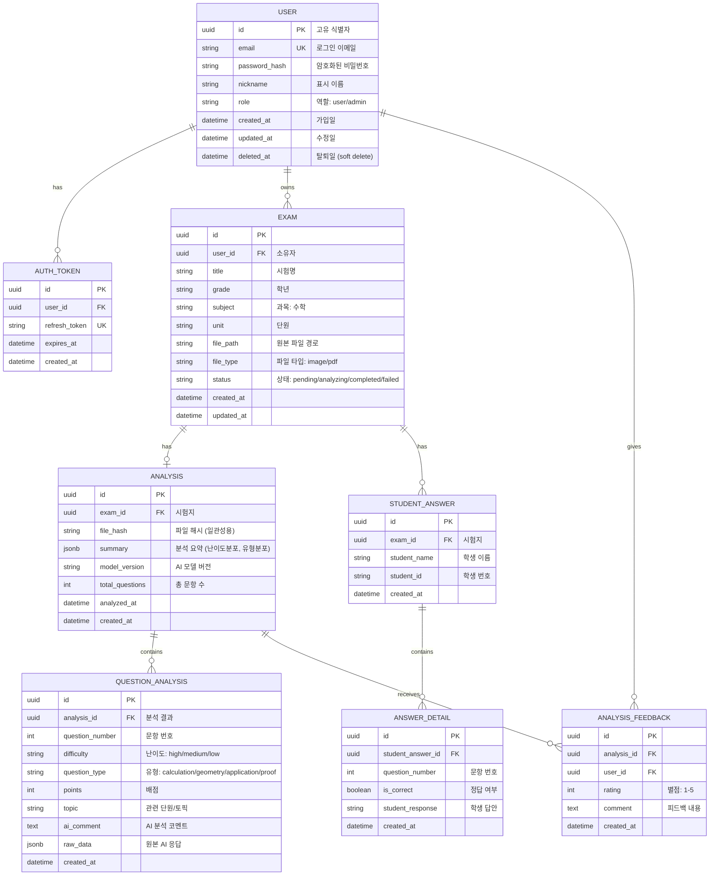

# Database Design (데이터베이스 설계)

> Mermaid ERD로 주요 엔티티와 관계를 표현합니다.
> 각 엔티티에 FEAT 주석을 달아 어떤 기능에서 사용되는지 명시합니다.
> 최소 수집 원칙을 반영하여 불필요한 개인정보는 지양합니다.

---

## MVP 캡슐

| # | 항목 | 내용 |
|---|------|------|
| 1 | 목표 | 수학 시험지를 AI로 분석하여 일관되고 객관적인 분석 결과 제공 |
| 2 | 페르소나 | 학원 운영자, 선생님 (교육업계 종사자) |
| 3 | 핵심 기능 | FEAT-1: 문항별 분석 (난이도, 유형, 정답률) |
| 4 | 성공 지표 (노스스타) | AI 분석 정확도/일관성 |
| 5 | 입력 지표 | 주간 분석 횟수, 사용자 만족도 |
| 6 | 비기능 요구 | 분석 결과 일관성 (같은 시험지 = 같은 맥락의 결과) |
| 7 | Out-of-scope | 외부 연동 (소셜로그인, 결제), 실시간 협업 |
| 8 | Top 리스크 | OCR 인식 정확도 (이미지/PDF에서 문제 추출 실패) |
| 9 | 완화/실험 | 수동 입력 폴백, 사용자 피드백으로 모델 개선 |
| 10 | 다음 단계 | 문항별 분석 MVP 개발 |

---

## 1. ERD (Entity Relationship Diagram)



---

## 2. 엔티티 상세 정의

### 2.1 USER (사용자) - FEAT-0

| 컬럼 | 타입 | 제약조건 | 설명 |
|------|------|----------|------|
| id | UUID | PK | 고유 식별자 |
| email | VARCHAR(255) | UNIQUE, NOT NULL | 로그인 이메일 |
| password_hash | VARCHAR(255) | NOT NULL | bcrypt 해싱된 비밀번호 |
| nickname | VARCHAR(50) | NOT NULL | 표시 이름 |
| role | VARCHAR(20) | NOT NULL, DEFAULT 'user' | 역할: user/admin |
| created_at | TIMESTAMP | NOT NULL, DEFAULT NOW() | 가입일 |
| updated_at | TIMESTAMP | NOT NULL | 최종 수정일 |
| deleted_at | TIMESTAMP | NULL | Soft delete용 |

**인덱스:**
- `idx_user_email` ON email
- `idx_user_deleted_at` ON deleted_at

**최소 수집 원칙 적용:**
- 필수: email, nickname
- 수집 안 함: 전화번호, 주소, 생년월일 (필요 없음)

---

### 2.2 AUTH_TOKEN (인증 토큰) - FEAT-0

| 컬럼 | 타입 | 제약조건 | 설명 |
|------|------|----------|------|
| id | UUID | PK | 고유 식별자 |
| user_id | UUID | FK → USER.id, NOT NULL | 사용자 |
| refresh_token | VARCHAR(500) | UNIQUE, NOT NULL | 리프레시 토큰 |
| expires_at | TIMESTAMP | NOT NULL | 만료일 |
| created_at | TIMESTAMP | NOT NULL, DEFAULT NOW() | 생성일 |

**인덱스:**
- `idx_auth_token_user_id` ON user_id
- `idx_auth_token_expires_at` ON expires_at

---

### 2.3 EXAM (시험지) - FEAT-1

| 컬럼 | 타입 | 제약조건 | 설명 |
|------|------|----------|------|
| id | UUID | PK | 고유 식별자 |
| user_id | UUID | FK → USER.id, NOT NULL | 소유자 |
| title | VARCHAR(200) | NOT NULL | 시험명 |
| grade | VARCHAR(20) | NULL | 학년 (예: 중2, 고1) |
| subject | VARCHAR(50) | NOT NULL, DEFAULT '수학' | 과목 |
| unit | VARCHAR(100) | NULL | 단원 |
| file_path | VARCHAR(500) | NOT NULL | 원본 파일 저장 경로 |
| file_type | VARCHAR(20) | NOT NULL | 파일 타입: image/pdf |
| status | VARCHAR(20) | NOT NULL, DEFAULT 'pending' | 상태 |
| created_at | TIMESTAMP | NOT NULL, DEFAULT NOW() | 생성일 |
| updated_at | TIMESTAMP | NOT NULL | 수정일 |

**상태 값:**
- `pending`: 업로드 완료, 분석 대기
- `analyzing`: 분석 진행 중
- `completed`: 분석 완료
- `failed`: 분석 실패

**인덱스:**
- `idx_exam_user_id` ON user_id
- `idx_exam_status` ON status
- `idx_exam_created_at` ON created_at DESC

---

### 2.4 ANALYSIS (분석 결과) - FEAT-1

| 컬럼 | 타입 | 제약조건 | 설명 |
|------|------|----------|------|
| id | UUID | PK | 고유 식별자 |
| exam_id | UUID | FK → EXAM.id, UNIQUE, NOT NULL | 시험지 (1:1 관계) |
| file_hash | VARCHAR(64) | NOT NULL | 파일 해시 (SHA-256) |
| summary | JSONB | NOT NULL | 분석 요약 |
| model_version | VARCHAR(50) | NOT NULL | AI 모델 버전 |
| total_questions | INTEGER | NOT NULL | 총 문항 수 |
| analyzed_at | TIMESTAMP | NOT NULL | 분석 완료 시각 |
| created_at | TIMESTAMP | NOT NULL, DEFAULT NOW() | 생성일 |

**summary JSONB 구조:**
```json
{
  "difficulty_distribution": {
    "high": 10,
    "medium": 15,
    "low": 5
  },
  "type_distribution": {
    "calculation": 12,
    "geometry": 8,
    "application": 7,
    "proof": 3
  },
  "average_difficulty": "medium",
  "dominant_type": "calculation"
}
```

**인덱스:**
- `idx_analysis_exam_id` ON exam_id
- `idx_analysis_file_hash` ON file_hash (일관성 캐싱용)

---

### 2.5 QUESTION_ANALYSIS (문항 분석) - FEAT-1

| 컬럼 | 타입 | 제약조건 | 설명 |
|------|------|----------|------|
| id | UUID | PK | 고유 식별자 |
| analysis_id | UUID | FK → ANALYSIS.id, NOT NULL | 분석 결과 |
| question_number | INTEGER | NOT NULL | 문항 번호 |
| difficulty | VARCHAR(20) | NOT NULL | 난이도: high/medium/low |
| question_type | VARCHAR(50) | NOT NULL | 유형 |
| points | INTEGER | NULL | 배점 |
| topic | VARCHAR(100) | NULL | 관련 단원/토픽 |
| ai_comment | TEXT | NULL | AI 분석 코멘트 |
| raw_data | JSONB | NULL | 원본 AI 응답 (디버깅용) |
| created_at | TIMESTAMP | NOT NULL, DEFAULT NOW() | 생성일 |

**question_type 값:**
- `calculation`: 계산 문제
- `geometry`: 도형 문제
- `application`: 응용/서술형
- `proof`: 증명 문제
- `graph`: 그래프/함수
- `statistics`: 통계/확률

**인덱스:**
- `idx_question_analysis_id` ON analysis_id
- `idx_question_number` ON (analysis_id, question_number) UNIQUE

---

### 2.6 STUDENT_ANSWER (학생 답안) - FEAT-3 (v2)

| 컬럼 | 타입 | 제약조건 | 설명 |
|------|------|----------|------|
| id | UUID | PK | 고유 식별자 |
| exam_id | UUID | FK → EXAM.id, NOT NULL | 시험지 |
| student_name | VARCHAR(50) | NOT NULL | 학생 이름 |
| student_id | VARCHAR(20) | NULL | 학생 번호 |
| created_at | TIMESTAMP | NOT NULL, DEFAULT NOW() | 생성일 |

**인덱스:**
- `idx_student_answer_exam_id` ON exam_id

---

### 2.7 ANSWER_DETAIL (답안 상세) - FEAT-3 (v2)

| 컬럼 | 타입 | 제약조건 | 설명 |
|------|------|----------|------|
| id | UUID | PK | 고유 식별자 |
| student_answer_id | UUID | FK → STUDENT_ANSWER.id, NOT NULL | 학생 답안 |
| question_number | INTEGER | NOT NULL | 문항 번호 |
| is_correct | BOOLEAN | NOT NULL | 정답 여부 |
| student_response | VARCHAR(500) | NULL | 학생 답안 텍스트 |
| created_at | TIMESTAMP | NOT NULL, DEFAULT NOW() | 생성일 |

**인덱스:**
- `idx_answer_detail_student_id` ON student_answer_id

---

### 2.8 ANALYSIS_FEEDBACK (분석 피드백) - FEAT-1

| 컬럼 | 타입 | 제약조건 | 설명 |
|------|------|----------|------|
| id | UUID | PK | 고유 식별자 |
| analysis_id | UUID | FK → ANALYSIS.id, NOT NULL | 분석 결과 |
| user_id | UUID | FK → USER.id, NOT NULL | 피드백 작성자 |
| rating | INTEGER | NOT NULL, CHECK (1-5) | 별점 |
| comment | TEXT | NULL | 피드백 내용 |
| created_at | TIMESTAMP | NOT NULL, DEFAULT NOW() | 생성일 |

**인덱스:**
- `idx_feedback_analysis_id` ON analysis_id

---

## 3. 관계 정의

| 부모 | 자식 | 관계 | 설명 |
|------|------|------|------|
| USER | AUTH_TOKEN | 1:N | 사용자는 여러 토큰 보유 가능 (다중 기기) |
| USER | EXAM | 1:N | 사용자는 여러 시험지 소유 |
| EXAM | ANALYSIS | 1:1 | 시험지당 하나의 분석 결과 |
| ANALYSIS | QUESTION_ANALYSIS | 1:N | 분석 결과는 여러 문항 분석 포함 |
| EXAM | STUDENT_ANSWER | 1:N | 시험지에 여러 학생 답안 (v2) |
| STUDENT_ANSWER | ANSWER_DETAIL | 1:N | 학생 답안에 문항별 상세 |
| ANALYSIS | ANALYSIS_FEEDBACK | 1:N | 분석 결과에 여러 피드백 |

---

## 4. 데이터 생명주기

| 엔티티 | 생성 시점 | 보존 기간 | 삭제/익명화 |
|--------|----------|----------|------------|
| USER | 회원가입 | 탈퇴 후 30일 | Hard delete |
| AUTH_TOKEN | 로그인 | 만료 시 | Hard delete |
| EXAM | 시험지 업로드 | 계정과 동일 | Cascade delete |
| ANALYSIS | 분석 완료 | 계정과 동일 | Cascade delete |
| QUESTION_ANALYSIS | 분석 완료 | 상위와 동일 | Cascade delete |
| STUDENT_ANSWER | 답안 업로드 | 계정과 동일 | Cascade delete |
| ANALYSIS_FEEDBACK | 피드백 작성 | 영구 (익명화 후) | 익명화 |

---

## 5. 일관성 보장 전략

### 5.1 파일 해시 기반 캐싱

동일한 시험지를 다시 분석할 때 일관된 결과를 보장합니다.

```sql
-- 분석 요청 시 캐시 확인
SELECT * FROM analysis
WHERE file_hash = 'sha256_hash_of_file'
AND model_version = 'current_version';
```

### 5.2 모델 버전 관리

AI 모델이나 프롬프트가 변경되면 `model_version`을 업데이트합니다.
- 같은 버전 내에서는 동일한 결과 보장
- 버전 변경 시 사용자에게 재분석 옵션 제공

---

## 6. 확장 고려사항

### 6.1 v2에서 추가 예정 엔티티

```mermaid
erDiagram
    %% v2: FEAT-4 클래스 관리
    CLASS {
        uuid id PK
        uuid user_id FK
        string name "클래스명"
        string grade "학년"
    }

    %% v2: 클래스-학생 연결
    CLASS_STUDENT {
        uuid id PK
        uuid class_id FK
        uuid student_answer_id FK
    }

    %% v2: 취약점 리포트
    WEAKNESS_REPORT {
        uuid id PK
        uuid student_answer_id FK
        jsonb weakness_analysis "취약점 분석"
        text recommendation "학습 추천"
    }
```

### 6.2 인덱스 전략

- **읽기 최적화**: 자주 조회되는 컬럼에 인덱스 (user_id, exam_id, status)
- **쓰기 고려**: 인덱스 과다 방지 (MVP에서는 최소한으로)
- **복합 인덱스**: 자주 함께 조회되는 컬럼 (analysis_id + question_number)

### 6.3 파티셔닝 고려 (스케일업 시)

분석 데이터가 많아지면 `created_at` 기준 월별 파티셔닝 검토

---

## Decision Log 참조

| ID | 항목 | 선택 | 근거 |
|----|------|------|------|
| DB-01 | PK 타입 | UUID | 분산 환경 대비, 보안 (예측 불가) |
| DB-02 | 분석 결과 저장 | JSONB | 유연한 구조, 쿼리 가능 |
| DB-03 | 일관성 전략 | file_hash 캐싱 | 같은 파일 = 같은 결과 |
| DB-04 | 삭제 전략 | Soft delete (USER) | 복구 가능성 |
| DB-05 | 시험지-분석 관계 | 1:1 | 한 시험지에 하나의 분석 결과 |
