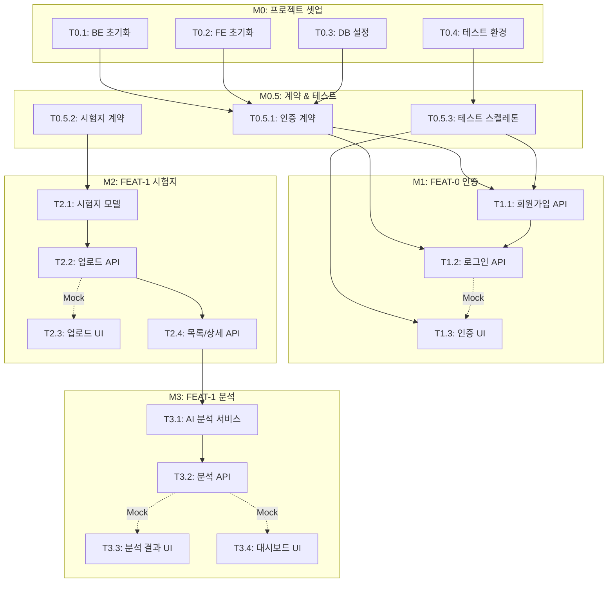

# TASKS: 수학 시험지 분석기 - AI 개발 파트너용 태스크 목록

## MVP 캡슐

| # | 항목 | 내용 |
|---|------|------|
| 1 | 목표 | 수학 시험지를 AI로 분석하여 일관되고 객관적인 분석 결과 제공 |
| 2 | 페르소나 | 학원 운영자, 선생님 (교육업계 종사자) |
| 3 | 핵심 기능 | FEAT-1: 문항별 분석 (난이도, 유형, 정답률) |
| 4 | 성공 지표 (노스스타) | AI 분석 정확도/일관성 |
| 5 | 입력 지표 | 주간 분석 횟수, 사용자 만족도 |
| 6 | 비기능 요구 | 분석 결과 일관성 (같은 시험지 = 같은 맥락의 결과) |
| 7 | Out-of-scope | 외부 연동 (소셜로그인, 결제), 실시간 협업 |
| 8 | Top 리스크 | OCR 인식 정확도 (이미지/PDF에서 문제 추출 실패) |
| 9 | 완화/실험 | 수동 입력 폴백, 사용자 피드백으로 모델 개선 |
| 10 | 다음 단계 | 문항별 분석 MVP 개발 |

---

## 기술 스택

| 구분 | 선택 |
|------|------|
| Backend | FastAPI (Python 3.11+) |
| Frontend | React 18+ with Vite |
| Database | PostgreSQL 15+ |
| ORM | SQLAlchemy 2.0 |
| 상태관리 | Zustand |
| 스타일링 | TailwindCSS |
| 테스트 (BE) | pytest, pytest-asyncio |
| 테스트 (FE) | Vitest, React Testing Library |
| E2E | Playwright |
| API Mock | MSW (Mock Service Worker) |

---

## 마일스톤 개요

| 마일스톤 | 설명 | Phase | 주요 산출물 |
|----------|------|-------|------------|
| M0 | 프로젝트 셋업 | Phase 0 | 프로젝트 구조, Docker, 린트 |
| M0.5 | 계약 & 테스트 선행 | Phase 0 | API 계약, Mock, 테스트 스켈레톤 |
| M1 | FEAT-0 인증 | Phase 1 | 회원가입, 로그인, JWT |
| M2 | FEAT-1 시험지 관리 | Phase 2 | 업로드, 목록, 상세 |
| M3 | FEAT-1 AI 분석 | Phase 3 | 문항별 분석, 결과 조회 |

---

## M0: 프로젝트 셋업

### [] Phase 0, T0.1: 백엔드 프로젝트 초기화

**담당**: backend-specialist

**작업 내용**:
- FastAPI 프로젝트 구조 생성
- 기본 의존성 설치 (requirements.txt / pyproject.toml)
- 환경변수 설정 (.env.example)
- Ruff + Black 설정

**산출물**:
- `backend/app/__init__.py`
- `backend/app/main.py`
- `backend/app/core/config.py`
- `backend/requirements.txt`
- `backend/pyproject.toml` (ruff, black 설정)
- `backend/.env.example`

**완료 조건**:
- [ ] `uvicorn app.main:app --reload` 실행 성공
- [ ] `/health` 엔드포인트 응답 확인
- [ ] `ruff check .` 통과

---

### [] Phase 0, T0.2: 프론트엔드 프로젝트 초기화

**담당**: frontend-specialist

**작업 내용**:
- Vite + React + TypeScript 프로젝트 생성
- TailwindCSS 설정
- ESLint + Prettier 설정
- 기본 디렉토리 구조 생성

**산출물**:
- `frontend/src/main.tsx`
- `frontend/src/App.tsx`
- `frontend/tailwind.config.js`
- `frontend/.eslintrc.cjs`
- `frontend/.prettierrc`
- `frontend/src/components/`, `pages/`, `hooks/`, `services/`, `stores/`, `types/`

**완료 조건**:
- [ ] `npm run dev` 실행 성공
- [ ] TailwindCSS 스타일 적용 확인
- [ ] `npm run lint` 통과

---

### [] Phase 0, T0.3: 데이터베이스 설정

**담당**: database-specialist

**작업 내용**:
- PostgreSQL Docker 컨테이너 설정
- SQLAlchemy 연결 설정
- Alembic 마이그레이션 초기화
- 기본 모델 (User) 생성

**산출물**:
- `docker-compose.yml` (PostgreSQL 서비스)
- `backend/app/core/database.py`
- `backend/app/models/__init__.py`
- `backend/app/models/user.py`
- `backend/alembic/` 디렉토리
- `backend/alembic.ini`

**완료 조건**:
- [ ] `docker-compose up db` 실행 성공
- [ ] `alembic upgrade head` 마이그레이션 성공
- [ ] DB 연결 테스트 통과

---

### [] Phase 0, T0.4: 테스트 환경 설정

**담당**: test-specialist

**작업 내용**:
- pytest 설정 (백엔드)
- Vitest 설정 (프론트엔드)
- MSW 설정 (API 모킹)
- 테스트 디렉토리 구조 생성

**산출물**:
- `backend/pytest.ini`
- `backend/conftest.py`
- `backend/tests/__init__.py`
- `frontend/vitest.config.ts`
- `frontend/src/mocks/server.ts`
- `frontend/src/mocks/handlers/index.ts`
- `frontend/src/__tests__/setup.ts`

**완료 조건**:
- [ ] `pytest --version` 실행 성공
- [ ] `npm run test` 실행 성공 (빈 테스트)
- [ ] MSW 모킹 동작 확인

---

## M0.5: 계약 & 테스트 선행 작성

### [] Phase 0, T0.5.1: API 계약 정의 (인증)

**담당**: backend-specialist

**작업 내용**:
- 인증 API 계약 정의 (TypeScript + Pydantic)
- Request/Response 스키마 작성
- BE/FE 공유 타입 생성

**산출물**:
- `contracts/types.ts` (공통 타입)
- `contracts/auth.contract.ts` (인증 API 계약)
- `backend/app/schemas/auth.py` (Pydantic 스키마)
- `frontend/src/types/auth.ts` (TypeScript 타입)

**완료 조건**:
- [ ] 계약 파일 생성 완료
- [ ] TypeScript 타입 체크 통과
- [ ] Pydantic 스키마 검증 통과

---

### [] Phase 0, T0.5.2: API 계약 정의 (시험지 & 분석)

**담당**: backend-specialist

**작업 내용**:
- 시험지 API 계약 정의
- 분석 API 계약 정의
- BE/FE 공유 타입 생성

**산출물**:
- `contracts/exam.contract.ts`
- `contracts/analysis.contract.ts`
- `backend/app/schemas/exam.py`
- `backend/app/schemas/analysis.py`
- `frontend/src/types/exam.ts`
- `frontend/src/types/analysis.ts`

**완료 조건**:
- [ ] 계약 파일 생성 완료
- [ ] TypeScript 타입 체크 통과
- [ ] Pydantic 스키마 검증 통과

---

### [] Phase 0, T0.5.3: 테스트 스켈레톤 작성 (RED 상태)

**담당**: test-specialist

**작업 내용**:
- 모든 API 엔드포인트에 대한 테스트 스켈레톤 작성
- 모든 테스트가 FAIL 상태로 작성 (RED)
- MSW 핸들러 스켈레톤 작성

**산출물**:
- `backend/tests/api/test_auth.py` (RED)
- `backend/tests/api/test_exam.py` (RED)
- `backend/tests/api/test_analysis.py` (RED)
- `frontend/src/mocks/handlers/auth.ts`
- `frontend/src/mocks/handlers/exam.ts`
- `frontend/src/mocks/handlers/analysis.ts`
- `frontend/src/__tests__/api/auth.test.ts` (RED)

**완료 조건**:
- [ ] 모든 테스트 파일 생성
- [ ] `pytest` 실행 시 모든 테스트 FAILED (예상대로)
- [ ] `npm run test` 실행 시 모든 테스트 FAILED (예상대로)

---

## M1: FEAT-0 인증

### [] Phase 1, T1.1: 회원가입 API RED→GREEN

**담당**: backend-specialist

**Git Worktree 설정**:
```bash
# 1. Worktree 생성
git worktree add ../math-report-phase1-auth -b phase/1-auth
cd ../math-report-phase1-auth

# 2. 작업 완료 후 병합 (사용자 승인 필요)
# git checkout main
# git merge phase/1-auth
# git worktree remove ../math-report-phase1-auth
```

**TDD 사이클**:

1. **RED**: 테스트 작성 (실패 확인)
   ```bash
   # 테스트 파일: backend/tests/api/test_auth.py
   pytest backend/tests/api/test_auth.py::test_register_success -v  # Expected: FAILED
   pytest backend/tests/api/test_auth.py::test_register_duplicate_email -v  # Expected: FAILED
   ```

2. **GREEN**: 최소 구현 (테스트 통과)
   ```bash
   # 구현 파일: backend/app/routes/auth.py, backend/app/services/auth.py
   pytest backend/tests/api/test_auth.py -v  # Expected: PASSED
   ```

3. **REFACTOR**: 리팩토링 (테스트 유지)
   - 코드 정리
   - 중복 제거
   - 테스트 계속 통과 확인

**산출물**:
- `backend/tests/api/test_auth.py` (회원가입 테스트)
- `backend/app/routes/auth.py` (회원가입 엔드포인트)
- `backend/app/services/auth.py` (회원가입 로직)
- `backend/app/models/user.py` (User 모델 완성)

**인수 조건**:
- [ ] POST `/api/v1/auth/register` 동작
- [ ] 이메일 중복 검사
- [ ] 비밀번호 bcrypt 해싱
- [ ] 모든 테스트 통과 (GREEN)
- [ ] 커버리지 >= 80%

**완료 시**:
- [ ] 사용자 승인 후 main 브랜치에 병합
- [ ] worktree 정리: `git worktree remove ../math-report-phase1-auth`

---

### [] Phase 1, T1.2: 로그인 API RED→GREEN

**담당**: backend-specialist

**Git Worktree 설정**: (T1.1과 동일 worktree 사용)

**TDD 사이클**:

1. **RED**: 테스트 작성 (실패 확인)
   ```bash
   pytest backend/tests/api/test_auth.py::test_login_success -v  # Expected: FAILED
   pytest backend/tests/api/test_auth.py::test_login_wrong_password -v  # Expected: FAILED
   ```

2. **GREEN**: 최소 구현 (테스트 통과)
   ```bash
   pytest backend/tests/api/test_auth.py -v  # Expected: PASSED
   ```

**산출물**:
- `backend/tests/api/test_auth.py` (로그인 테스트 추가)
- `backend/app/routes/auth.py` (로그인 엔드포인트)
- `backend/app/core/security.py` (JWT 토큰 생성)

**인수 조건**:
- [ ] POST `/api/v1/auth/login` 동작
- [ ] JWT Access Token 발급
- [ ] Refresh Token 발급 및 저장
- [ ] 잘못된 비밀번호 시 401 응답
- [ ] 모든 테스트 통과 (GREEN)

---

### [] Phase 1, T1.3: 인증 UI 컴포넌트 RED→GREEN

**담당**: frontend-specialist

**Git Worktree 설정**:
```bash
git worktree add ../math-report-phase1-auth-fe -b phase/1-auth-fe
cd ../math-report-phase1-auth-fe
```

**의존성**: T1.1, T1.2 - **MSW Mock 사용으로 독립 개발 가능**

**Mock 설정**:
```typescript
// frontend/src/mocks/handlers/auth.ts
export const authHandlers = [
  http.post('/api/v1/auth/register', () => {
    return HttpResponse.json({ id: '1', email: 'test@test.com' });
  }),
  http.post('/api/v1/auth/login', () => {
    return HttpResponse.json({ access_token: 'mock-token', refresh_token: 'mock-refresh' });
  }),
];
```

**TDD 사이클**:

1. **RED**: 테스트 작성 (실패 확인)
   ```bash
   npm run test -- src/__tests__/components/LoginForm.test.tsx  # Expected: FAILED
   npm run test -- src/__tests__/components/RegisterForm.test.tsx  # Expected: FAILED
   ```

2. **GREEN**: 최소 구현 (테스트 통과)
   ```bash
   npm run test  # Expected: PASSED
   ```

**산출물**:
- `frontend/src/__tests__/components/LoginForm.test.tsx`
- `frontend/src/__tests__/components/RegisterForm.test.tsx`
- `frontend/src/components/auth/LoginForm.tsx`
- `frontend/src/components/auth/RegisterForm.tsx`
- `frontend/src/pages/LoginPage.tsx`
- `frontend/src/pages/RegisterPage.tsx`
- `frontend/src/stores/authStore.ts`

**인수 조건**:
- [ ] 로그인 폼 렌더링
- [ ] 회원가입 폼 렌더링
- [ ] 폼 제출 시 API 호출
- [ ] 에러 메시지 표시
- [ ] 로그인 성공 시 토큰 저장
- [ ] 모든 테스트 통과 (GREEN)

---

## M2: FEAT-1 시험지 관리

### [] Phase 2, T2.1: 시험지 모델 & 마이그레이션 RED→GREEN

**담당**: database-specialist

**Git Worktree 설정**:
```bash
git worktree add ../math-report-phase2-exam -b phase/2-exam
cd ../math-report-phase2-exam
```

**TDD 사이클**:

1. **RED**: 테스트 작성
   ```bash
   pytest backend/tests/unit/test_models.py::test_exam_model -v  # Expected: FAILED
   ```

2. **GREEN**: 모델 구현
   ```bash
   pytest backend/tests/unit/test_models.py -v  # Expected: PASSED
   ```

**산출물**:
- `backend/tests/unit/test_models.py`
- `backend/app/models/exam.py`
- `backend/app/models/analysis.py`
- `backend/alembic/versions/xxx_create_exam_tables.py`

**인수 조건**:
- [ ] Exam 모델 생성 (04-database-design.md 참조)
- [ ] Analysis 모델 생성
- [ ] QuestionAnalysis 모델 생성
- [ ] 마이그레이션 성공
- [ ] 모든 테스트 통과 (GREEN)

---

### [] Phase 2, T2.2: 시험지 업로드 API RED→GREEN

**담당**: backend-specialist

**Git Worktree 설정**: (T2.1과 동일 worktree 사용)

**TDD 사이클**:

1. **RED**: 테스트 작성
   ```bash
   pytest backend/tests/api/test_exam.py::test_upload_exam_image -v  # Expected: FAILED
   pytest backend/tests/api/test_exam.py::test_upload_exam_pdf -v  # Expected: FAILED
   ```

2. **GREEN**: 구현
   ```bash
   pytest backend/tests/api/test_exam.py -v  # Expected: PASSED
   ```

**산출물**:
- `backend/tests/api/test_exam.py`
- `backend/app/routes/exam.py`
- `backend/app/services/exam.py`
- `backend/app/services/file_storage.py`

**인수 조건**:
- [ ] POST `/api/v1/exams` 파일 업로드 동작
- [ ] 이미지 (JPG, PNG) 지원
- [ ] PDF 지원
- [ ] 파일 크기 제한 (10MB)
- [ ] 파일 타입 검증
- [ ] 모든 테스트 통과 (GREEN)

---

### [] Phase 2, T2.3: 시험지 업로드 UI RED→GREEN

**담당**: frontend-specialist

**Git Worktree 설정**:
```bash
git worktree add ../math-report-phase2-exam-fe -b phase/2-exam-fe
cd ../math-report-phase2-exam-fe
```

**의존성**: T2.2 - **MSW Mock 사용으로 독립 개발 가능**

**TDD 사이클**:

1. **RED**: 테스트 작성
   ```bash
   npm run test -- src/__tests__/components/ExamUploader.test.tsx  # Expected: FAILED
   ```

2. **GREEN**: 구현
   ```bash
   npm run test  # Expected: PASSED
   ```

**산출물**:
- `frontend/src/__tests__/components/ExamUploader.test.tsx`
- `frontend/src/components/exam/ExamUploader.tsx`
- `frontend/src/components/exam/FileDropZone.tsx`
- `frontend/src/pages/ExamUploadPage.tsx`
- `frontend/src/services/examService.ts`

**인수 조건**:
- [ ] 드래그앤드롭 파일 업로드
- [ ] 파일 선택 버튼
- [ ] 미리보기 표시
- [ ] 업로드 진행률 표시
- [ ] 에러 메시지 표시
- [ ] 모든 테스트 통과 (GREEN)

---

### [] Phase 2, T2.4: 시험지 목록/상세 API RED→GREEN

**담당**: backend-specialist

**TDD 사이클**:

1. **RED**: 테스트 작성
   ```bash
   pytest backend/tests/api/test_exam.py::test_get_exams_list -v  # Expected: FAILED
   pytest backend/tests/api/test_exam.py::test_get_exam_detail -v  # Expected: FAILED
   ```

2. **GREEN**: 구현
   ```bash
   pytest backend/tests/api/test_exam.py -v  # Expected: PASSED
   ```

**산출물**:
- `backend/tests/api/test_exam.py` (목록/상세 테스트 추가)
- `backend/app/routes/exam.py` (GET 엔드포인트)

**인수 조건**:
- [ ] GET `/api/v1/exams` 목록 조회
- [ ] GET `/api/v1/exams/{id}` 상세 조회
- [ ] 페이지네이션 지원
- [ ] 본인 시험지만 조회 가능
- [ ] 모든 테스트 통과 (GREEN)

---

## M3: FEAT-1 AI 분석

### [] Phase 3, T3.1: AI 분석 서비스 RED→GREEN

**담당**: backend-specialist

**Git Worktree 설정**:
```bash
git worktree add ../math-report-phase3-analysis -b phase/3-analysis
cd ../math-report-phase3-analysis
```

**TDD 사이클**:

1. **RED**: 테스트 작성
   ```bash
   pytest backend/tests/unit/test_analysis_service.py -v  # Expected: FAILED
   ```

2. **GREEN**: 구현
   ```bash
   pytest backend/tests/unit/test_analysis_service.py -v  # Expected: PASSED
   ```

**산출물**:
- `backend/tests/unit/test_analysis_service.py`
- `backend/app/services/analysis.py` (AI 분석 로직)
- `backend/app/services/ai_client.py` (LLM API 클라이언트)
- `backend/app/core/prompts.py` (분석 프롬프트)

**인수 조건**:
- [ ] LLM API 호출
- [ ] 문항별 난이도 분석 (high/medium/low)
- [ ] 문항별 유형 분류
- [ ] 분석 결과 캐싱 (파일 해시 기반)
- [ ] Temperature 0으로 일관성 보장
- [ ] 모든 테스트 통과 (GREEN)

---

### [] Phase 3, T3.2: 분석 요청 API RED→GREEN

**담당**: backend-specialist

**TDD 사이클**:

1. **RED**: 테스트 작성
   ```bash
   pytest backend/tests/api/test_analysis.py::test_request_analysis -v  # Expected: FAILED
   pytest backend/tests/api/test_analysis.py::test_get_analysis_result -v  # Expected: FAILED
   ```

2. **GREEN**: 구현
   ```bash
   pytest backend/tests/api/test_analysis.py -v  # Expected: PASSED
   ```

**산출물**:
- `backend/tests/api/test_analysis.py`
- `backend/app/routes/analysis.py`

**인수 조건**:
- [ ] POST `/api/v1/exams/{id}/analyze` 분석 요청
- [ ] GET `/api/v1/analysis/{id}` 결과 조회
- [ ] 분석 상태 관리 (pending/analyzing/completed/failed)
- [ ] 비동기 분석 처리
- [ ] 모든 테스트 통과 (GREEN)

---

### [] Phase 3, T3.3: 분석 결과 UI RED→GREEN

**담당**: frontend-specialist

**Git Worktree 설정**:
```bash
git worktree add ../math-report-phase3-analysis-fe -b phase/3-analysis-fe
cd ../math-report-phase3-analysis-fe
```

**의존성**: T3.2 - **MSW Mock 사용으로 독립 개발 가능**

**TDD 사이클**:

1. **RED**: 테스트 작성
   ```bash
   npm run test -- src/__tests__/components/AnalysisResult.test.tsx  # Expected: FAILED
   npm run test -- src/__tests__/components/QuestionCard.test.tsx  # Expected: FAILED
   ```

2. **GREEN**: 구현
   ```bash
   npm run test  # Expected: PASSED
   ```

**산출물**:
- `frontend/src/__tests__/components/AnalysisResult.test.tsx`
- `frontend/src/__tests__/components/QuestionCard.test.tsx`
- `frontend/src/components/analysis/AnalysisResult.tsx`
- `frontend/src/components/analysis/QuestionCard.tsx`
- `frontend/src/components/analysis/DifficultyChart.tsx`
- `frontend/src/components/analysis/TypeChart.tsx`
- `frontend/src/pages/AnalysisResultPage.tsx`

**인수 조건**:
- [ ] 분석 요약 카드 표시
- [ ] 문항별 상세 카드 표시
- [ ] 난이도 분포 차트
- [ ] 유형 분포 차트
- [ ] 로딩 상태 표시
- [ ] 모든 테스트 통과 (GREEN)

---

### [] Phase 3, T3.4: 대시보드 UI RED→GREEN

**담당**: frontend-specialist

**TDD 사이클**:

1. **RED**: 테스트 작성
   ```bash
   npm run test -- src/__tests__/pages/Dashboard.test.tsx  # Expected: FAILED
   ```

2. **GREEN**: 구현
   ```bash
   npm run test  # Expected: PASSED
   ```

**산출물**:
- `frontend/src/__tests__/pages/Dashboard.test.tsx`
- `frontend/src/pages/DashboardPage.tsx`
- `frontend/src/components/dashboard/ExamCard.tsx`
- `frontend/src/components/dashboard/RecentAnalysisList.tsx`

**인수 조건**:
- [ ] 새 분석 시작 버튼
- [ ] 최근 분석 목록 표시
- [ ] 시험지 카드 클릭 시 상세로 이동
- [ ] 빈 상태 메시지 표시
- [ ] 모든 테스트 통과 (GREEN)

---

## 의존성 그래프



---

## 병렬 실행 가능 태스크

| Phase | 병렬 실행 가능 태스크 | 조건 |
|-------|----------------------|------|
| Phase 0 | T0.1, T0.2 | 독립적 |
| Phase 0 | T0.5.1, T0.5.2 | T0.1~T0.3 완료 후 |
| Phase 1 | T1.1, T1.2 | 순차 (T1.1 → T1.2) |
| Phase 1 | T1.1/T1.2 (BE), T1.3 (FE) | Mock 사용 시 병렬 가능 |
| Phase 2 | T2.2 (BE), T2.3 (FE) | Mock 사용 시 병렬 가능 |
| Phase 3 | T3.2 (BE), T3.3/T3.4 (FE) | Mock 사용 시 병렬 가능 |

---

## 예상 일정 (참고용)

| 마일스톤 | 태스크 수 | 병렬 가능 |
|----------|----------|----------|
| M0 | 4개 | 2개 동시 |
| M0.5 | 3개 | 2개 동시 |
| M1 | 3개 | BE/FE 병렬 |
| M2 | 4개 | BE/FE 병렬 |
| M3 | 4개 | BE/FE 병렬 |

---

## 품질 게이트

**모든 태스크 완료 시 필수 체크:**

- [ ] 모든 단위 테스트 통과
- [ ] 커버리지 >= 80%
- [ ] 린트 통과 (Ruff / ESLint)
- [ ] 타입 체크 통과 (mypy / tsc)
- [ ] E2E 테스트 통과 (해당 기능)
- [ ] 사용자 승인 후 main 병합
